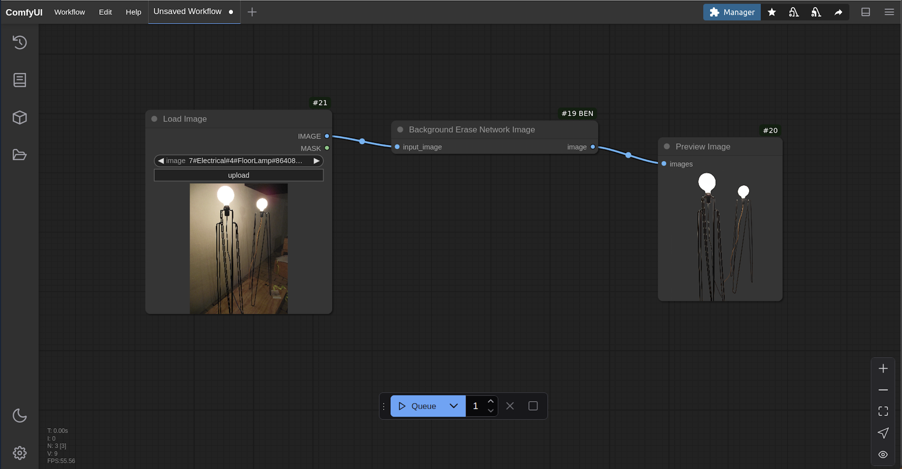

# ComfyUI BEN - Background Erase Network

****


Remove backgrounds from images with [BEN2](https://huggingface.co/PramaLLC/BEN2) in [ComfyUI](https://github.com/comfyanonymous/ComfyUI)

## Installation

```
git clone https://github.com/PramaLLC/BEN2_ComfyUI.git
```
```
cd BEN2_ComfyUI
```
```
pip install -r requirements.txt
```
Go to the [BEN2 huggingface page](https://huggingface.co/PramaLLC/BEN2/tree/main) and download `BEN2_Base.pth`and place them inside:
```
...ComfyUI/custom-nodes/ComfyUI-BEN/
```
The folder should look like this:
```
└── ComfyUI/custom-nodes/ComfyUI-BEN/
    ├── __init__.py
    ├── background_erase_network.py
    ├── ben.png
    ├── BEN2_Base.pth
    ├── BEN2.py
    ├── README.md
    └── requirements.txt
```
## Nodes

### Background Erase Network



## Credits

- [comfyanonymous/ComfyUI](https://github.com/comfyanonymous/ComfyUI)

- [DoctorDiffusion/ComfyUI-BEN](https://github.com/DoctorDiffusion/ComfyUI-BEN)

⭐ If you like the project, please give it a star! ⭐

